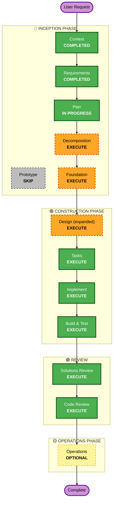

# Execution Plan

## Summary
<!-- Compact digest. Downstream phases: read ONLY this section. -->
- **Project Type**: Greenfield
- **Risk**: Medium — rollback Moderate
- **Execute**: decomposition (standard), foundation (incremental), per-unit design (expanded, standard), tasks, implement, build-test
- **Skip**: prototype (requirements clear)
- **Routing**: decomposition
- **Derived From**: 32 stories, 7 functional areas / 8 domains, 4 personas, 1 MVP integration (SSO)

## Scope & Impact Analysis

### Change Impact Assessment
- **User-facing changes**: Yes — full new UI (dashboards, project/portfolio/resource/RAID/intake screens) for 4 MVP roles
- **Structural changes**: Yes — entire greenfield architecture across 8 bounded domains
- **Data-model changes**: Yes — new relational model (Goal, Portfolio, Program, Project, Milestone, Resource, Allocation, RaidItem, DemandRequest, User/Role)
- **API changes**: Yes — new API surface per domain (contracts defined at Foundation + per-unit design)
- **NFR impact**: Yes — RBAC + record-level authZ, immutable audit, availability, reporting performance at scale; security & resiliency baselines are blocking

---

## Risk Assessment
- **Risk Level**: Medium
- **Rollback Complexity**: Moderate — versioned releases and standard schema migrations; recoverable with effort
- **Testing Complexity**: Complex — RBAC/authZ matrix, allocation/utilization math (PBT), stage-gate workflow, roll-up aggregation, SSO integration
- **Key Unknowns**: Technology stack (decided at D3); SSO IdP specifics; reporting-performance strategy at scale
- **Mitigations**: Balanced risk posture with review gates; shared Foundation freezes cross-unit contracts before parallel unit work; Solutions Review before implementation converges; PBT (partial) on math/serialization; security & resiliency baselines enforced at design/implement/code-review

---

## Phase Plan

Tasks, implement, and build-test always execute downstream.

### 🔵 INCEPTION
- [x] Context — COMPLETED
- [x] Requirements — COMPLETED
- [x] Plan — IN PROGRESS
- [ ] Prototype — **SKIP**
  - **Rationale**: Governance-first MVP requirements are clear and well-bounded; a throwaway spike adds a loop without reducing meaningful uncertainty.
- [ ] Decomposition — **EXECUTE**
  - **Depth**: standard · **Rationale**: 8 bounded domains / 7 functional areas with distinct DDD boundaries; unit breakdown enables parallel team work.
- [ ] Foundation — **EXECUTE**
  - **Rationale**: Greenfield + incremental multi-unit mode — shared conventions, cross-unit contracts, common data model, RBAC/audit scaffolding, and CI must exist before units diverge.

### 🟢 CONSTRUCTION
- [ ] Design — **EXECUTE** — mode: **expanded**
  - **Depth**: standard · **Rationale**: Enterprise platform with blocking security/resiliency extensions; expanded sub-stages (components, data model, API, integration, NFR) per unit.
- [ ] Tasks — EXECUTE (ALWAYS)
- [ ] Implement — EXECUTE (ALWAYS)
- [ ] Build & Test — EXECUTE (ALWAYS)

### 🟡 OPERATIONS
- [ ] Operations — OPTIONAL (run after code-review — deployment/monitoring/incident scaffold)

---

## Workflow Visualization

---

## Routing Recommendation
- **Recommended Next Phase**: Decomposition
- **Reason**: Greenfield platform spanning 8 bounded domains / 7 functional areas with a small team building incrementally. Decomposition defines unit boundaries; Foundation then freezes shared contracts so units can be designed and built in parallel. Prototype skipped — requirements are clear.

---

## Success Criteria
- **Primary Goal**: Deliver a governance-first EPM/EPPM MVP that lets an EPMO allocate resources, manage cross-team RAID, and align every project to strategy — in one system of record.
- **Key Deliverables**: Unit decomposition; shared Foundation (data model, RBAC/audit, API/contract conventions, CI); per-unit expanded designs; implemented + tested units; solutions review + code review.
- **Quality Gates**: security-baseline (blocking), resiliency-baseline (blocking), property-based-testing partial (blocking for math/serialization), cross-unit Solutions Review, final Code Review. Every MVP story traceable to a unit; every project links to a strategic goal.
